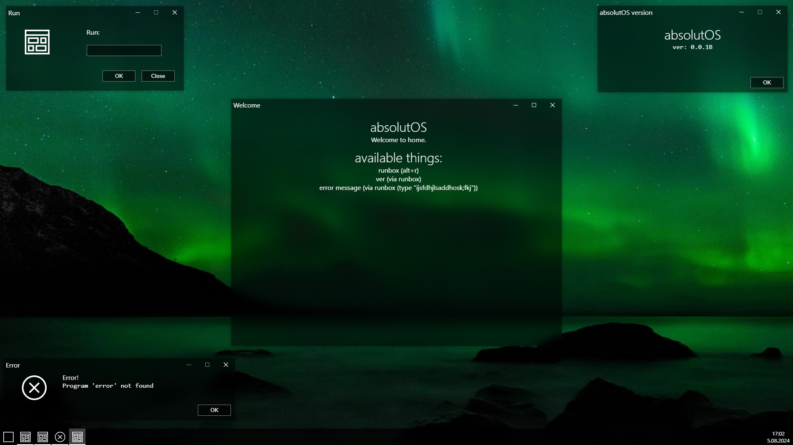

<h3>version: 0.0.1B</h3>

<h2>Available things:</h2>
<ul>
  <li>Sounds</li>
  <li>Window:</li>
    <ul>
      <li>Move</li>
      <li>Maximize</li>
      <li>Close</li>
    </ul>
  <li>Apps:</li>
    <ul>
      <li>Welcome screen</li>
      <li>runbox (alt + r)</li>
      <li>ver (via runbox)</li>
      <li>masgboz (via runbox (type "asdasdds"))</li>
    </ul>
  <li>API:</li>
    <ul>
      <li>WindowManager</li>
      <li>Programs</li>
      <li>Process</li>
      <li>iframeLinkAPI</li>
    </ul>
</ul>
<h2>Design:</h2>

Transparent dark with blur design (something like Mica) + ease-out animations

